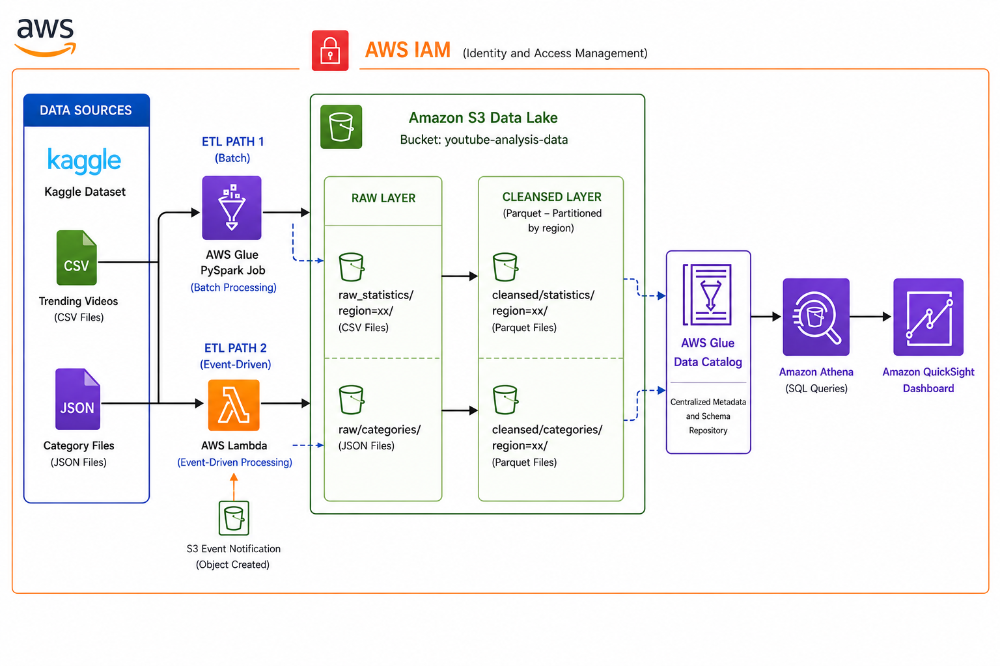
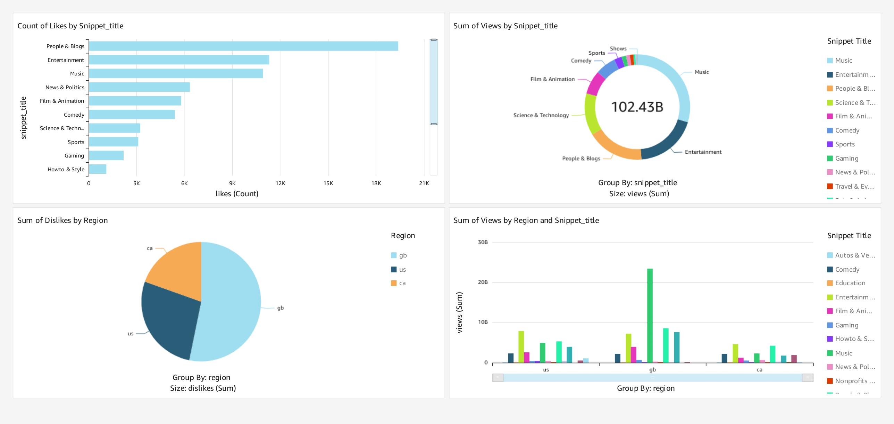

# 🎥 YouTube Data Engineering Analytics Project

## Overview

This project implements an end-to-end AWS Data Engineering pipeline for analyzing YouTube trending video data across multiple regions. The solution ingests raw CSV and JSON files, transforms them using AWS Glue and Lambda, stores them in an Amazon S3 Data Lake, and enables analytics through Amazon Athena and QuickSight dashboards.

## Key Features

- Automated data ingestion from multiple sources
- ETL processing using AWS Glue (PySpark)
- Event-driven processing with AWS Lambda
- Data Lake architecture on Amazon S3
- Data cataloging with AWS Glue Data Catalog
- Interactive analytics using Amazon Athena
- Dashboard reporting with Amazon QuickSight

## AWS Services Used

- Amazon S3
- AWS Glue
- AWS Lambda
- AWS IAM
- AWS Glue Data Catalog
- Amazon Athena
- Amazon QuickSight

## Dataset

The project uses the YouTube Trending Videos dataset from Kaggle, containing trending video statistics, engagement metrics, and category metadata across multiple regions.

**Dataset:** https://www.kaggle.com/datasets/datasnaek/youtube-new

## Architecture

## Dashboard

## Skills Demonstrated

AWS • Data Engineering • ETL • PySpark • SQL • Data Lakes • Athena • QuickSight • Serverless Architecture
